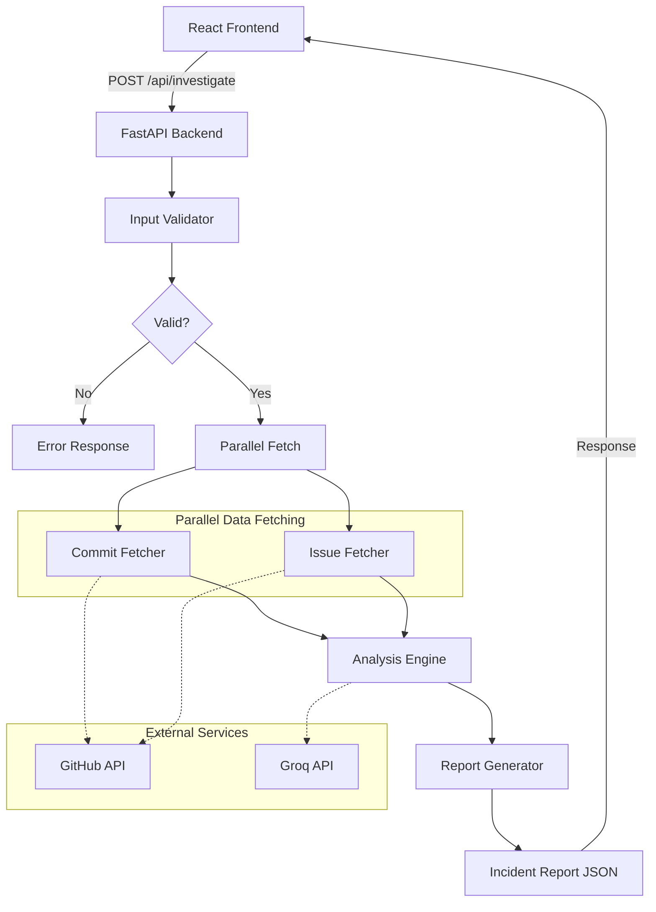
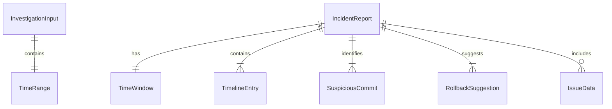

# Design Document: Incident Timeline Correlator

## Overview

The Incident Timeline Correlator is a web application with a **React + TypeScript frontend** and **Python FastAPI backend** that helps engineers identify root causes of production incidents by correlating GitHub commit history (with code diffs) and issues with AI-powered analysis via Groq. It orchestrates data fetching from the GitHub API, sends the combined data to Groq for reasoning, and produces a structured incident report.

The system follows a pipeline architecture: Input Validation → Data Fetching (parallel) → AI Analysis → Report Generation.

### Key Design Decisions

- **Python/FastAPI backend** for async request handling, Pydantic models, and easy integration with PyGithub and Groq SDK.
- **React/TypeScript frontend** with Vite for fast development and type-safe component architecture.
- **Groq AI** for analysis (fast inference, generous free tier, no AWS quota issues).
- **Pipeline architecture** with discrete async stages enabling parallel data fetching.
- **User-provided GitHub token** (in-memory only, never persisted) for private repo access and higher rate limits.
- **No retries on GitHub API** — fail fast to avoid long backoff waits on rate limits.
- **Commit diffs included** in prompts for code-level root cause analysis.

## Architecture



### Component Flow

1. **Frontend** collects repo URL, time range, and optional GitHub token from user.
2. **Input Validator** validates the GitHub URL format and time range constraints (max 7 days).
3. **Commit Fetcher** and **Issue Fetcher** run in parallel, both using the user-provided or server-configured GitHub token.
4. **Analysis Engine** constructs a prompt with commits (including diffs), issues, and time window, then calls Groq.
5. **Report Generator** transforms the Groq response into a structured Incident Report, sanitizing variant field names and invalid types.

## Components and Interfaces

### Backend Components

| Component | Module | Responsibility |
|-----------|--------|----------------|
| InputValidator | `app/services/input_validator.py` | Validates GitHub URL pattern and time range constraints |
| CommitFetcher | `app/services/commit_fetcher.py` | Fetches commits with diffs from GitHub API via PyGithub |
| IssueFetcher | `app/services/issue_fetcher.py` | Fetches GitHub issues within time window via PyGithub |
| AnalysisEngine | `app/services/analysis_engine.py` | Constructs prompts and calls Groq AI for reasoning |
| ReportGenerator | `app/services/report_generator.py` | Maps AI response to structured IncidentReport schema |
| InvestigateRouter | `app/routers/investigate.py` | FastAPI route handler for POST /api/investigate |

### Frontend Components

| Component | Module | Responsibility |
|-----------|--------|----------------|
| InvestigationForm | `src/components/InvestigationForm.tsx` | Collects repo URL, token, time range from user |
| IncidentReport | `src/components/IncidentReport.tsx` | Displays full incident report with collapsible sections |
| Timeline | `src/components/Timeline.tsx` | Renders chronological timeline with colored markers |
| ErrorDisplay | `src/components/ErrorDisplay.tsx` | Displays error messages from API |
| APIClient | `src/api/client.ts` | HTTP client for backend communication |

### Interfaces

#### InputValidator

```python
class InputValidator:
    def validate(self, input: InvestigationInput) -> TimeWindow:
        """Validates repo URL pattern and time range. Returns TimeWindow or raises ValueError."""
        ...
```

- Validates URL matches `https://github.com/{owner}/{repo}`
- Validates start < end
- Validates duration ≤ 168 hours (7 days)
- Returns parsed `TimeWindow` on success

#### CommitFetcher

```python
class CommitFetcher:
    async def fetch(self, repo_url: str, time_window: TimeWindow, token: str | None) -> list[CommitData]:
        """Fetches up to 250 commits within time window. Fails fast on errors."""
        ...
```

- Uses PyGithub with provided or server-configured token
- Includes patch/diff content (2,000 chars/file, 8,000 total/commit)
- No retries on failure

#### IssueFetcher

```python
class IssueFetcher:
    async def fetch(self, repo_url: str, time_window: TimeWindow, token: str | None) -> list[IssueData]:
        """Fetches up to 50 issues (open + closed) within time window. Fails fast on errors."""
        ...
```

- Fetches issues created or updated within time window
- Truncates body to 500 characters
- No retries on failure

#### AnalysisEngine

```python
class AnalysisEngine:
    async def analyze(self, commits: list[CommitData], issues: list[IssueData], time_window: TimeWindow) -> dict:
        """Constructs prompt and calls Groq AI. Returns parsed JSON response."""
        ...
```

- Constructs prompt with commits (including diffs), issues, and time window boundaries
- Token budget: 60,000 characters max
- Truncation priority: preserve all commits and issues, truncate logs first
- Calls Groq API with configured model (default: `llama-3.3-70b-versatile`)

#### ReportGenerator

```python
class ReportGenerator:
    def generate(self, ai_response: dict, time_window: TimeWindow, issues: list[IssueData]) -> IncidentReport:
        """Maps AI response to IncidentReport, handling variant keys and invalid types."""
        ...
```

- Handles variant key names (camelCase, snake_case) from AI response
- Sanitizes invalid timeline entry types (infers from content)
- Auto-generates rollback commands from suspicious commits if AI omits them
- Truncates root cause to 500 characters

#### REST API

```
POST /api/investigate
  Request Body: InvestigationInput (JSON)
  Response 200: IncidentReport (JSON)
  Response 400: ErrorResponse (validation errors)
  Response 401: ErrorResponse (auth errors)
  Response 429: ErrorResponse (rate limit)
  Response 500: ErrorResponse (server/API errors)
```

## Data Models

### Core Models (Pydantic)

```python
class TimeRange(BaseModel):
    start: str          # ISO 8601 timestamp
    end: str            # ISO 8601 timestamp

class InvestigationInput(BaseModel):
    repo_url: str              # GitHub URL (alias: repoUrl)
    time_range: TimeRange | None  # Required (alias: timeRange)
    github_token: str | None   # User-provided, in-memory only (alias: githubToken)

class TimeWindow(BaseModel):
    start: datetime
    end: datetime

class CommitData(BaseModel):
    sha: str               # 40-char hex
    author: str
    author_email: str      # alias: authorEmail
    timestamp: str         # ISO 8601
    message: str           # up to 72,000 chars
    changed_files: list[str]  # up to 3,000 files (alias: changedFiles)
    patch: str | None      # Combined diff content

class IssueData(BaseModel):
    number: int
    title: str
    state: str             # "open" or "closed"
    created_at: str        # alias: createdAt
    updated_at: str        # alias: updatedAt
    labels: list[str]
    body: str | None       # Truncated to 500 chars
    url: str               # HTML URL

class SuspiciousCommit(BaseModel):
    sha: str
    confidence: Literal["High", "Medium", "Low"]
    explanation: str

class RollbackSuggestion(BaseModel):
    sha: str
    command: str           # e.g., "git revert {sha}"

class TimelineEntry(BaseModel):
    timestamp: str
    type: Literal["commit", "log_event", "metric_data_point"]
    summary: str
    details: dict

class IncidentReport(BaseModel):
    time_window: TimeWindow       # alias: timeWindow
    timeline: list[TimelineEntry]
    suspicious_commits: list[SuspiciousCommit]  # alias: suspiciousCommits
    root_cause: str               # max 500 chars (alias: rootCause)
    suggested_rollback: list[RollbackSuggestion]  # alias: suggestedRollback
    issues: list[IssueData] | None

class ErrorResponse(BaseModel):
    code: str       # Machine-readable (AUTH_ERROR, RATE_LIMITED, etc.)
    message: str    # Human-readable explanation
    details: str | None
```

### Model Relationships



### Field Aliasing

All models support both camelCase (frontend JSON) and snake_case (Python) via Pydantic's `populate_by_name = True` config and field aliases.

## Correctness Properties

*A property is a characteristic or behavior that should hold true across all valid executions of a system — essentially, a formal statement about what the system should do. Properties serve as the bridge between human-readable specifications and machine-verifiable correctness guarantees.*

### Property 1: Input validation accepts valid inputs and rejects invalid ones

*For any* GitHub URL and time range pair, the InputValidator SHALL accept the input if and only if the URL matches `https://github.com/{owner}/{repo}`, start < end, and duration ≤ 168 hours; otherwise it SHALL return a descriptive error.

**Validates: Requirements 1.1, 1.2, 1.3, 1.5**

### Property 2: Commit data field extraction completeness

*For any* GitHub API commit response object, the CommitFetcher SHALL extract all required fields (sha, author, author_email, timestamp, message, changed_files, patch) and the resulting CommitData object SHALL contain the same values as the source.

**Validates: Requirements 2.2**

### Property 3: Issue body truncation

*For any* GitHub issue with a body of arbitrary length, the IssueFetcher SHALL produce an IssueData where the body field is at most 500 characters, and if the original body was ≤ 500 characters it SHALL be preserved exactly.

**Validates: Requirements 3.2**

### Property 4: Prompt contains all input data

*For any* non-empty set of commits and issues with a valid time window, the prompt constructed by the AnalysisEngine SHALL contain every commit SHA and every issue number from the input datasets.

**Validates: Requirements 4.1, 4.2**

### Property 5: Truncation preserves commits and issues

*For any* combined dataset exceeding 60,000 characters, the AnalysisEngine's truncation logic SHALL preserve all commit entries and all issue entries in the resulting prompt, while reducing total size to within the token budget.

**Validates: Requirements 4.5**

### Property 6: Timeline chronological ordering

*For any* set of timeline entries in an IncidentReport, the entries SHALL be ordered by timestamp in ascending chronological order.

**Validates: Requirements 5.2**

### Property 7: Root cause length invariant

*For any* AI response containing a root cause string, the ReportGenerator SHALL produce a root_cause field of at most 500 characters.

**Validates: Requirements 5.4**

### Property 8: Rollback auto-generation from suspicious commits

*For any* AI response that identifies suspicious commits but provides no explicit rollback suggestions, the ReportGenerator SHALL auto-generate a rollback suggestion for each suspicious commit with a command matching `git revert {sha}`.

**Validates: Requirements 5.5**

### Property 9: Variant key normalization

*For any* AI response containing timeline, suspicious commit, or rollback data using variant key names (camelCase or snake_case), the ReportGenerator SHALL correctly map all keys to the canonical IncidentReport schema.

**Validates: Requirements 5.8**

### Property 10: Invalid timeline type sanitization

*For any* timeline entry with a type value not in the set {"commit", "log_event", "metric_data_point"}, the ReportGenerator SHALL infer the correct type from entry content or default to "log_event".

**Validates: Requirements 5.9**

### Property 11: Incident report serialization round-trip

*For any* valid IncidentReport object, serializing it to JSON and parsing the resulting JSON back SHALL produce an equivalent IncidentReport object.

**Validates: Requirements 6.1, 6.2, 6.3**

### Property 12: Invalid input produces descriptive errors

*For any* input that is either syntactically invalid JSON or valid JSON that does not conform to the IncidentReport schema, the parser SHALL return a descriptive error rather than a valid IncidentReport.

**Validates: Requirements 6.4, 6.5**

## Error Handling

| Category | Source | Behavior |
|----------|--------|----------|
| Validation Errors | InputValidator | Returned immediately (400) |
| Auth Errors | GitHub API, Groq | Returned immediately with guidance (401) |
| Rate Limits | GitHub API, Groq | Returned immediately, no retries (429) |
| Not Found | GitHub API | Returned immediately (404 on repo) |
| Parse Errors | Groq response | Returned with raw response snippet (500) |
| Server Errors | GitHub API, Groq | Returned immediately, no retries (500) |

### Error Response Format

```python
class ErrorResponse(BaseModel):
    code: str       # Machine-readable (AUTH_ERROR, RATE_LIMITED, VALIDATION_ERROR, etc.)
    message: str    # Human-readable explanation
    details: str | None  # Additional context (e.g., raw response snippet)
```

### Error Codes

| Code | HTTP Status | Meaning |
|------|-------------|---------|
| `VALIDATION_ERROR` | 400 | Invalid URL, time range, or missing fields |
| `AUTH_ERROR` | 401 | Invalid or expired GitHub/Groq token |
| `NOT_FOUND` | 404 | Repository does not exist or is inaccessible |
| `RATE_LIMITED` | 429 | GitHub or Groq API rate limit exceeded |
| `ANALYSIS_FAILED` | 500 | Groq returned unparseable response |
| `GITHUB_UNAVAILABLE` | 500 | GitHub API unreachable or server error |
| `GROQ_UNAVAILABLE` | 500 | Groq API unreachable or server error |

## Testing Strategy

### Unit Tests (pytest for backend, Vitest for frontend)

**Backend unit tests** cover:
- InputValidator: valid/invalid URLs, time range edge cases, duration boundary (168h)
- CommitFetcher: field extraction from mocked PyGithub objects, patch truncation
- IssueFetcher: field extraction from mocked PyGithub objects, body truncation
- AnalysisEngine: prompt construction, truncation logic, error handling
- ReportGenerator: variant key mapping, type inference, rollback auto-generation, root cause truncation
- Models: Pydantic serialization/deserialization, alias handling

**Frontend unit tests** cover:
- InvestigationForm: input validation, 7-day constraint, token visibility toggle
- IncidentReport: rendering with various data shapes
- Timeline: chronological rendering, empty state
- ErrorDisplay: error code to message mapping
- APIClient: request formatting, error response parsing

### Property-Based Tests (Hypothesis for Python)

Property-based tests validate universal correctness properties across generated inputs. Each test runs a minimum of 100 iterations.

| Property | Test Target | Generator Strategy |
|----------|-------------|-------------------|
| Property 1: Input validation | `InputValidator.validate()` | Random URLs (valid/invalid patterns) + random time ranges |
| Property 2: Commit field extraction | `CommitFetcher` mapping logic | Random GitHub API commit response dicts |
| Property 3: Issue body truncation | `IssueFetcher` mapping logic | Random strings of varying length for body |
| Property 4: Prompt completeness | `AnalysisEngine.build_prompt()` | Random lists of CommitData and IssueData |
| Property 5: Truncation preserves data | `AnalysisEngine.truncate()` | Large random datasets exceeding 60,000 chars |
| Property 6: Timeline ordering | `ReportGenerator` sorting | Random lists of TimelineEntry with varied timestamps |
| Property 7: Root cause length | `ReportGenerator.generate()` | Random strings of length 0–2000 |
| Property 8: Rollback auto-generation | `ReportGenerator.generate()` | Random suspicious commits with empty rollback lists |
| Property 9: Key normalization | `ReportGenerator` mapping | Random dicts with camelCase/snake_case variants |
| Property 10: Type sanitization | `ReportGenerator` type inference | Random timeline entries with invalid type values |
| Property 11: Serialization round-trip | `IncidentReport` model | Random valid IncidentReport objects via Hypothesis strategies |
| Property 12: Invalid input errors | `IncidentReport` parser | Random invalid JSON and non-conforming dicts |

**Library:** Hypothesis (Python) with custom strategies for domain objects.

**Configuration:**
- Minimum 100 examples per property (`@settings(max_examples=100)`)
- Each test tagged with: `# Feature: incident-timeline-correlator, Property {N}: {description}`

### Integration Tests (pytest)

- End-to-end `/api/investigate` with mocked GitHub + Groq responses
- Error propagation from GitHub API failures
- Error propagation from Groq API failures
- Token fallback behavior (user token → server token → no token)

### Test Tools

| Layer | Framework | Runner |
|-------|-----------|--------|
| Backend unit + property | pytest + Hypothesis | `pytest` |
| Frontend unit | Vitest + React Testing Library | `vitest --run` |
| Integration | pytest | `pytest -m integration` |

## Security Considerations

- GitHub tokens are **never persisted** server-side (in-memory only per request)
- Frontend stores token in React state only (no localStorage, no sessionStorage)
- Tokens cleared on page reload
- Server `.env` file is in `.gitignore`
- CORS restricted to localhost development origins

## Configuration

```
# backend/.env
GROQ_API_KEY=gsk_...           # Required: Groq API key for AI analysis
GROQ_MODEL=llama-3.3-70b-versatile  # Optional: model override
GITHUB_TOKEN=ghp_...           # Optional: fallback server token
```

The user's GitHub token provided via the UI takes priority over the server `.env` token. It is held in memory only during the request and never written to disk.
