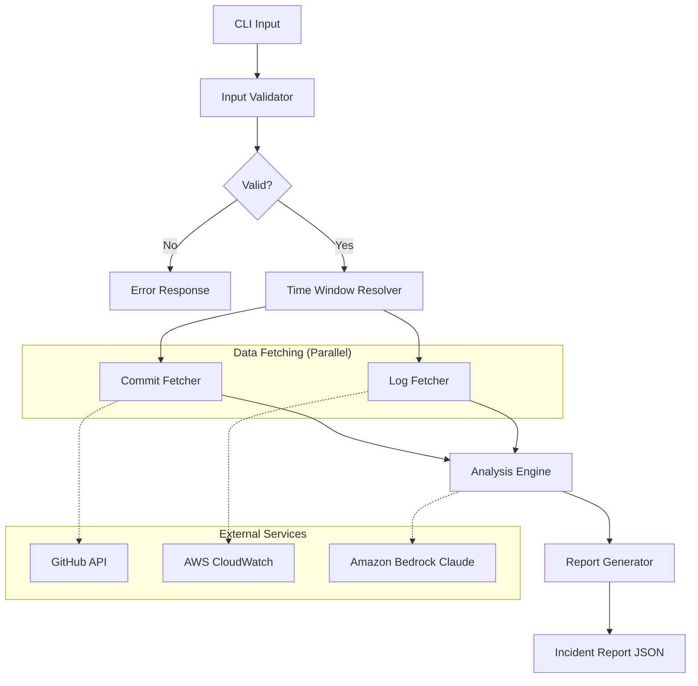

# Design Document: Incident Timeline Correlator

## Overview

The Incident Timeline Correlator is a TypeScript/Node.js CLI tool that helps engineers identify root causes of production incidents by correlating GitHub commit history with AWS CloudWatch observability data. It orchestrates data fetching from GitHub and AWS APIs, sends the combined data to Amazon Bedrock Claude for reasoning, and produces a structured incident report with a timeline, suspicious commits, root cause analysis, and rollback suggestions.

The system follows a pipeline architecture: Input Validation → Data Fetching (parallel) → Analysis → Report Generation. Each stage is a discrete, testable component with clear interfaces.

### Key Design Decisions

- **TypeScript** for type safety, strong ecosystem support for AWS SDKs and GitHub APIs, and native JSON handling.
- **Pipeline architecture** with discrete stages to enable independent testing, retry logic, and future extensibility (e.g., adding PagerDuty or Datadog sources).
- **Parallel data fetching** for GitHub commits and CloudWatch data to minimize total latency.
- **Structured error propagation** using discriminated union result types rather than thrown exceptions, enabling callers to handle errors explicitly.

## Architecture



### Component Flow

1. **Input Validator** validates the GitHub URL format, time range constraints, or CloudWatch alarm ARN.
2. **Time Window Resolver** either passes through the provided time range or resolves the alarm ARN to timestamps.
3. **Commit Fetcher** and **Log Fetcher** run in parallel, each with retry logic.
4. **Analysis Engine** constructs a prompt from the fetched data, manages token limits via truncation, and calls Bedrock Claude.
5. **Report Generator** transforms the Bedrock response into a structured Incident Report.

## Components and Interfaces

### InputValidator

Responsible for validating and normalizing user-provided input.

```typescript
interface InvestigationInput {
  repoUrl: string;
  timeRange?: { start: string; end: string }; // ISO 8601
  alarmArn?: string;
}

interface ValidationResult {
  success: true;
  data: ValidatedInput;
} | {
  success: false;
  error: ValidationError;
}

interface ValidatedInput {
  owner: string;
  repo: string;
  timeWindow: TimeWindow;
}

interface TimeWindow {
  start: Date;
  end: Date;
}

interface ValidationError {
  code: 'INVALID_URL' | 'INVALID_TIME_RANGE' | 'TIME_RANGE_EXCEEDS_MAX' | 'MISSING_TIME_SOURCE' | 'INVALID_ALARM';
  message: string;
}
```

### TimeWindowResolver

Resolves a CloudWatch alarm ARN into a concrete TimeWindow.

```typescript
interface TimeWindowResolver {
  resolveFromAlarm(alarmArn: string): Promise<Result<TimeWindow, ResolverError>>;
}

type ResolverError = {
  code: 'ALARM_NOT_FOUND' | 'INVALID_ARN' | 'AWS_AUTH_ERROR';
  message: string;
};
```

### CommitFetcher

Retrieves commit data from the GitHub API.

```typescript
interface CommitFetcher {
  fetchCommits(owner: string, repo: string, window: TimeWindow): Promise<Result<CommitList, FetchError>>;
}

interface CommitData {
  sha: string;          // 40-character hex
  author: string;
  authorEmail: string;
  timestamp: string;    // ISO 8601
  message: string;      // up to 72,000 chars
  changedFiles: string[]; // up to 3,000 files
}

interface CommitList {
  commits: CommitData[];  // up to 250
  warning?: string;       // e.g., "no commits found"
}

type FetchError = {
  code: 'AUTH_ERROR' | 'RATE_LIMITED' | 'API_UNAVAILABLE';
  message: string;
  resetTime?: string;     // for rate limit
};
```

### LogFetcher

Retrieves CloudWatch logs and metrics.

```typescript
interface LogFetcher {
  fetchLogs(logGroups: string[], window: TimeWindow): Promise<Result<LogEventList, FetchError>>;
  fetchMetrics(metrics: MetricQuery[], window: TimeWindow): Promise<Result<MetricDataList, FetchError>>;
}

interface LogEvent {
  timestamp: string;    // ISO 8601
  logGroup: string;
  logStream: string;
  message: string;      // up to 4,000 chars
}

interface LogEventList {
  events: LogEvent[];   // up to 10,000
  warning?: string;
}

interface MetricDataPoint {
  timestamp: string;    // ISO 8601
  metricName: string;
  namespace: string;
  value: number;
  unit: string;
}

interface MetricDataList {
  dataPoints: MetricDataPoint[];
  warning?: string;
}

interface MetricQuery {
  metricName: string;
  namespace: string;
  dimensions?: Record<string, string>;
}

type FetchError = {
  code: 'AWS_AUTH_ERROR' | 'LOG_GROUP_NOT_FOUND' | 'METRIC_NOT_FOUND' | 'THROTTLED' | 'API_UNAVAILABLE';
  message: string;
  details?: string;
};
```

### AnalysisEngine

Constructs the prompt, manages token limits, and calls Bedrock Claude.

```typescript
interface AnalysisEngine {
  analyze(data: AnalysisInput): Promise<Result<AnalysisOutput, AnalysisError>>;
}

interface AnalysisInput {
  commits: CommitData[];
  logEvents: LogEvent[];
  metricDataPoints: MetricDataPoint[];
  timeWindow: TimeWindow;
}

interface AnalysisOutput {
  timeline: TimelineEntry[];
  suspiciousCommits: SuspiciousCommit[];
  rootCause: string;
  suggestedRollbacks: RollbackSuggestion[];
}

type AnalysisError = {
  code: 'BEDROCK_ERROR' | 'AUTH_ERROR' | 'TIMEOUT';
  message: string;
  details?: string;
};
```

### ReportGenerator

Transforms analysis output into the final IncidentReport and handles serialization/parsing.

```typescript
interface ReportGenerator {
  generate(analysis: AnalysisOutput, timeWindow: TimeWindow): IncidentReport;
  serialize(report: IncidentReport): string;
  parse(json: string): Result<IncidentReport, ParseError>;
}

type ParseError = {
  code: 'INVALID_JSON' | 'SCHEMA_VIOLATION';
  message: string;
  fieldErrors?: FieldError[];
};

interface FieldError {
  field: string;
  reason: string;
}
```

## Data Models

### IncidentReport

```typescript
interface IncidentReport {
  timeWindow: {
    start: string;  // ISO 8601
    end: string;    // ISO 8601
  };
  timeline: TimelineEntry[];
  suspiciousCommits: SuspiciousCommit[];
  rootCause: string;           // max 500 chars
  suggestedRollback: RollbackSuggestion[];
}

interface TimelineEntry {
  timestamp: string;   // ISO 8601
  type: 'commit' | 'log_event' | 'metric_data_point';
  summary: string;
  details: CommitData | LogEvent | MetricDataPoint;
}

interface SuspiciousCommit {
  sha: string;
  confidence: 'High' | 'Medium' | 'Low';
  explanation: string;
}

interface RollbackSuggestion {
  sha: string;
  command: string;  // e.g., "git revert abc123"
}
```

### Token Budget Management

```typescript
interface TokenBudget {
  maxTokens: number;          // Bedrock Claude context window limit
  commitTokens: number;       // Always preserved
  metricTokens: number;       // Second priority
  logTokens: number;          // Truncated first
  promptOverhead: number;     // System prompt + framing
}
```

### Result Type

```typescript
type Result<T, E> = 
  | { success: true; data: T }
  | { success: false; error: E };
```


## Correctness Properties

*A property is a characteristic or behavior that should hold true across all valid executions of a system — essentially, a formal statement about what the system should do. Properties serve as the bridge between human-readable specifications and machine-verifiable correctness guarantees.*

### Property 1: GitHub URL Validation

*For any* string, the InputValidator SHALL accept it as a valid GitHub repository URL if and only if it matches the pattern `https://github.com/{owner}/{repo}` where owner and repo are non-empty strings containing valid GitHub characters. All other strings SHALL be rejected with an INVALID_URL error.

**Validates: Requirements 1.1, 1.3**

### Property 2: Time Range Validation

*For any* pair of ISO 8601 timestamps (start, end), the InputValidator SHALL accept the time range if and only if start is strictly earlier than end AND the duration between start and end does not exceed 72 hours. Time ranges where start >= end SHALL produce an INVALID_TIME_RANGE error, and time ranges exceeding 72 hours SHALL produce a TIME_RANGE_EXCEEDS_MAX error.

**Validates: Requirements 1.4, 1.7**

### Property 3: Commit Data Mapping

*For any* GitHub API commit response containing a SHA, author details, timestamp, message, and changed files, the Commit_Fetcher's mapping function SHALL produce a CommitData object with: a 40-character SHA, author name, author email, ISO 8601 timestamp, message truncated to 72,000 characters, and changed files list truncated to 3,000 entries.

**Validates: Requirements 2.2**

### Property 4: Log Event Mapping and Truncation

*For any* CloudWatch log event with arbitrary message content, the Log_Fetcher's mapping function SHALL produce a LogEvent object containing the timestamp, log group name, log stream name, and message content truncated to at most 4,000 characters. The first 4,000 characters of the original message SHALL be preserved.

**Validates: Requirements 3.3**

### Property 5: Metric Data Point Mapping

*For any* CloudWatch metric data point, the Log_Fetcher's mapping function SHALL produce a MetricDataPoint object containing all required fields: timestamp, metric name, namespace, value, and unit.

**Validates: Requirements 3.4**

### Property 6: Prompt Construction Completeness

*For any* set of commits, log events, metric data points, and time window, the Analysis_Engine's prompt construction SHALL produce a prompt string that contains a representation of every commit, every log event, every metric data point, and both time window boundaries.

**Validates: Requirements 4.2**

### Property 7: Token-Aware Truncation Ordering

*For any* combined dataset (commits, log events, metric data points) that exceeds the configured token limit, the Analysis_Engine's truncation logic SHALL: (1) always preserve all commits, (2) remove the oldest log events first until the limit is met or all logs are exhausted, and (3) if still over the limit, remove the oldest metric data points until the limit is met. The resulting prompt SHALL fit within the token limit.

**Validates: Requirements 4.5, 4.6**

### Property 8: Timeline Chronological Ordering

*For any* set of timeline entries with various timestamps, the Report Generator SHALL produce a timeline sorted in ascending chronological order by timestamp. For entries sharing identical timestamps, the ordering SHALL be: commits first, then log events, then metric data points.

**Validates: Requirements 5.2**

### Property 9: Root Cause Length Constraint

*For any* analysis output containing a root cause string, the Incident_Report SHALL include a root cause summary that is at most 500 characters. If the AI-produced root cause exceeds 500 characters, it SHALL be truncated to exactly 500 characters.

**Validates: Requirements 5.4**

### Property 10: Rollback Command Format

*For any* suspicious commit identified for rollback with a given SHA, the suggested rollback section SHALL contain a command string matching the format `git revert {sha}` where `{sha}` is the full 40-character commit SHA.

**Validates: Requirements 5.5**

### Property 11: Incident Report Serialization Round-Trip

*For any* valid IncidentReport object, serializing it to JSON and then parsing the resulting JSON back SHALL produce an IncidentReport object with field-by-field equality to the original across all sections (Timeline, Suspicious Commits, Root Cause, Suggested Rollback).

**Validates: Requirements 6.1, 6.2, 6.3**

### Property 12: Schema Violation Error Reporting

*For any* valid JSON object that does not conform to the IncidentReport schema (missing required fields, incorrect field types, or invalid enum values), the parser SHALL return a SCHEMA_VIOLATION error that identifies each specific field that is invalid or missing.

**Validates: Requirements 6.4**

## Error Handling

### Error Propagation Strategy

The system uses a `Result<T, E>` type throughout, avoiding thrown exceptions for expected error conditions. Each component returns typed errors that the orchestrator can handle or propagate to the user.

### Error Categories

| Category | Source | Behavior |
|----------|--------|----------|
| Validation Errors | InputValidator | Returned immediately, no retries |
| Authentication Errors | GitHub API, AWS APIs, Bedrock | Returned immediately with credential guidance |
| Rate Limit / Throttling | GitHub API, CloudWatch | Retry 3× with exponential backoff, then error |
| Server Errors | GitHub API, CloudWatch | Retry 3× with exponential backoff, then error |
| Timeout | Bedrock API | 60-second timeout, no retry |
| Parse Errors | Report Parser | Returned immediately with field-level details |

### Retry Strategy

```typescript
interface RetryConfig {
  maxAttempts: 3;
  baseDelayMs: 1000;
  maxDelayMs: 10000;
  backoffMultiplier: 2;
}
```

Retries apply only to transient errors (5xx, throttling). Authentication errors, validation errors, and not-found errors are never retried.

### Error Response Format

All errors returned to the user include:
- A machine-readable error code
- A human-readable message describing what went wrong
- Context-specific details (e.g., which log group was not found, when the rate limit resets)

### Graceful Degradation

- If no commits are found, the system proceeds with an empty commit list and includes a warning.
- If no log events or metrics are found, the system proceeds with empty collections and includes warnings.
- The system never silently drops data — any truncation or omission is reported to the user.

## Testing Strategy

### Property-Based Testing

This feature uses **fast-check** (TypeScript property-based testing library) for property tests. Each property test runs a minimum of 100 iterations with randomly generated inputs.

Property-based tests validate the universal correctness properties defined in the Correctness Properties section. They are tagged with references to the specific property they implement:

```typescript
// Feature: incident-timeline-correlator, Property 11: Incident Report Serialization Round-Trip
```

**Applicable properties for PBT:**
- Property 1: GitHub URL validation (generate random strings, verify accept/reject)
- Property 2: Time range validation (generate random timestamp pairs)
- Property 3: Commit data mapping (generate random API responses)
- Property 4: Log event mapping and truncation (generate random messages)
- Property 5: Metric data point mapping (generate random metric data)
- Property 6: Prompt construction completeness (generate random datasets)
- Property 7: Token-aware truncation ordering (generate datasets of varying sizes)
- Property 8: Timeline chronological ordering (generate events with various timestamps)
- Property 9: Root cause length constraint (generate strings of varying lengths)
- Property 10: Rollback command format (generate random SHAs)
- Property 11: Serialization round-trip (generate random valid IncidentReport objects)
- Property 12: Schema violation error reporting (generate random invalid JSON objects)

### Unit Tests (Example-Based)

Unit tests cover specific scenarios, edge cases, and integration error handling:

- Input with missing time source returns appropriate error (Req 1.6)
- GitHub API 401 returns AUTH_ERROR (Req 2.3)
- GitHub API 429 returns RATE_LIMITED with reset time (Req 2.4)
- Empty commit list includes warning (Req 2.5)
- Retry logic executes 3 times with backoff (Req 2.6, 3.9)
- AWS auth error returns proper error (Req 3.5)
- Missing log group identified in error (Req 3.6)
- Missing metric identified in error (Req 3.7)
- Empty CloudWatch results include warning (Req 3.8)
- Bedrock error includes details (Req 4.3)
- Bedrock auth error returns credential guidance (Req 4.4)
- Bedrock timeout at 60 seconds (Req 4.7)
- Report generated within 5 seconds (Req 5.1)
- Suspicious commits include confidence and explanation (Req 5.3)
- Report contains all labeled sections (Req 5.6)
- No suspicious commits produces note (Req 5.7)
- Invalid JSON returns parse error (Req 6.5)

### Integration Tests

Integration tests verify end-to-end behavior with mocked external services:

- Full pipeline: valid input → GitHub fetch → CloudWatch fetch → Bedrock analysis → report generation
- Pipeline with CloudWatch alarm resolution as time source
- Pipeline with empty commits (graceful degradation)
- Pipeline with data exceeding token limits (truncation behavior)

### Test Infrastructure

- **Test runner**: Vitest (fast, TypeScript-native)
- **Property testing**: fast-check
- **Mocking**: Vitest built-in mocking for external API clients
- **CI configuration**: All property tests run with 100 iterations; unit tests run on every push
